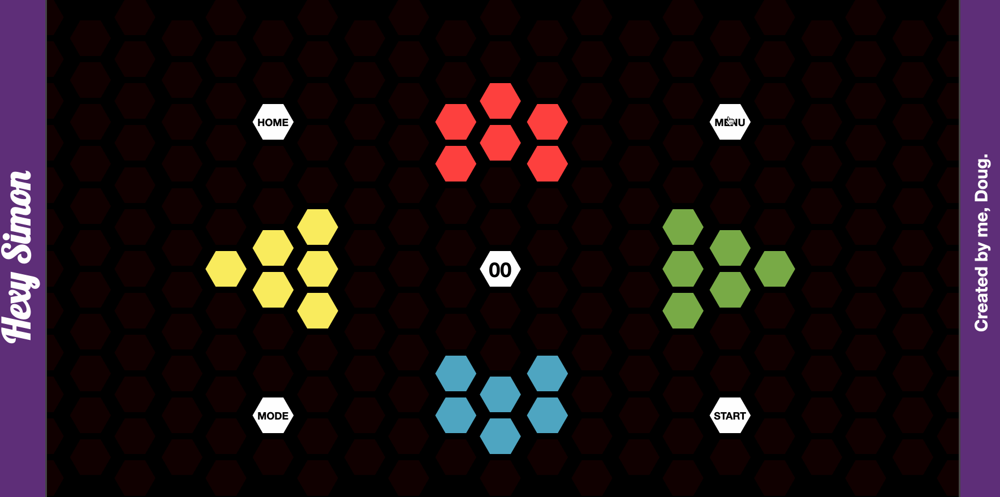

# Simon

My first go at the game of Simon in JavaScript/jQuery, CSS & HTML as one of the final projects to freeCodeCamp's frontend development program. It's a simple game and I hope you enjoy.

   

## Getting Started

Play on my [site](http://www.spazcool.com/simon/) or host locally after download.

### Prerequisites

A browser and an internet connection is all you'll need.

### Installing

No installation required.

### Version

This is the first version that is "live". Let me know if there are any issues.

## Built With

* jQuery
* HTML
* CSS

## Authors

* **Douglas Wright** - [Spazcool](https://github.com/Spazcool)

## License

This project is licensed under the MIT License - see the [LICENSE.md](LICENSE.md) file for details

## Acknowledgments

* [freeCodeCamp's Simon Rroject](https://www.freecodecamp.com/challenges/build-a-simon-game)
